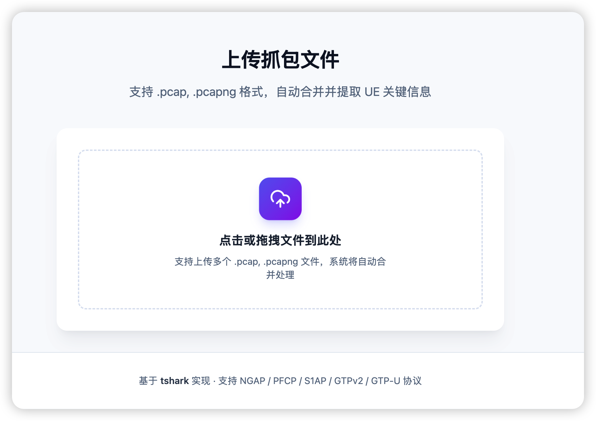
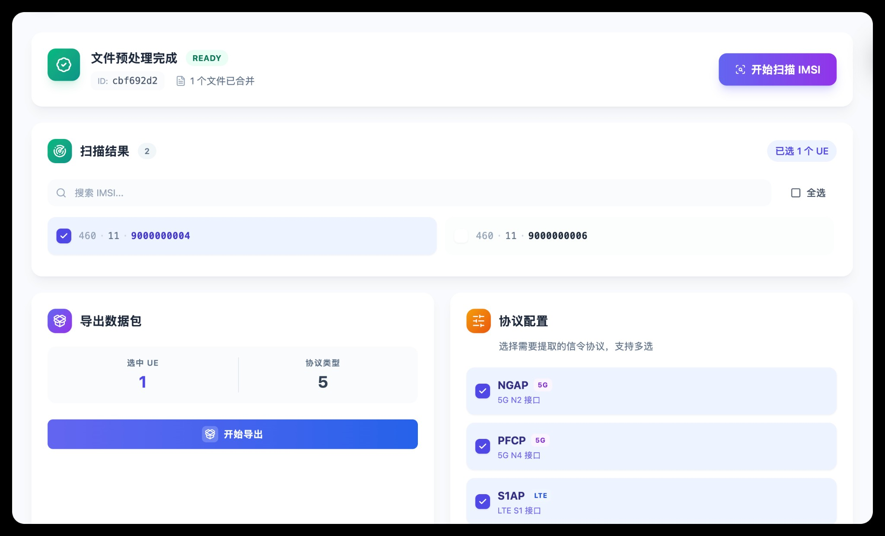
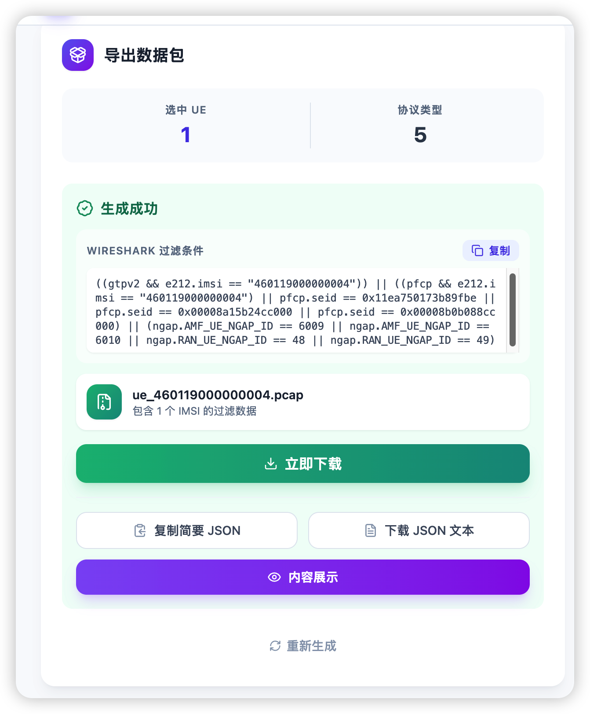

# UE PCAP Filter - IMSI 关联数据包过滤工具

基于 Go + Vite/React 构建的 Web 应用，通过 tshark 从 PCAP 文件中按 IMSI 关联提取 UE 相关的信令包。

## 功能特性

- **多文件上传合并**：支持上传多个 PCAP 文件，自动合并为一个文件
- **IMSI 自动扫描**：从 PCAP 中提取所有 IMSI（支持 NGAP/PFCP/S1AP/GTPv2/NAS）
- **协议关联过滤**：基于 IMSI 关联 UE 会话标识符（RAN/AMF ID、SEID、TEID 等）
- **多协议支持**：NGAP (5G)、PFCP (5G N4)、S1AP (LTE)、GTPv2-C、GTP-U
- **批量导出**：选择多个 IMSI 批量导出，自动打包为 ZIP
- **实时流式扫描**：使用 SSE 实时推送 IMSI 扫描结果

---

## 系统架构

### 整体架构图

```
┌─────────────────────────────────────────────────────────────────────────────┐
│                              UE PCAP Filter                                  │
├─────────────────────────────────────────────────────────────────────────────┤
│                                                                              │
│  ┌──────────────┐    HTTP/SSE     ┌──────────────────────────────────────┐  │
│  │              │ ◄──────────────► │                                      │  │
│  │   Frontend   │                  │            Go Backend                │  │
│  │  (React +    │   REST API       │                                      │  │
│  │   Vite)      │   /api/jobs/*    │  ┌────────────┐  ┌────────────────┐  │  │
│  │              │                  │  │    API     │  │  Job Manager   │  │  │
│  │  ┌────────┐  │                  │  │  Handler   │──│  (内存存储)    │  │  │
│  │  │Upload  │  │                  │  └─────┬──────┘  └────────────────┘  │  │
│  │  │IMSI选择│  │                  │        │                             │  │
│  │  │协议选择│  │                  │        ▼                             │  │
│  │  │导出面板│  │                  │  ┌────────────────────────────────┐  │  │
│  │  └────────┘  │                  │  │      Protocol Module           │  │  │
│  │              │                  │  │  ┌──────────┐  ┌─────────────┐ │  │  │
│  └──────────────┘                  │  │  │ Scanner  │  │  Resolver   │ │  │  │
│                                    │  │  │(IMSI扫描)│  │(过滤器解析) │ │  │  │
│                                    │  │  └──────────┘  └─────────────┘ │  │  │
│                                    │  └────────────┬───────────────────┘  │  │
│                                    │               │                      │  │
│                                    │               ▼                      │  │
│                                    │  ┌────────────────────────────────┐  │  │
│                                    │  │       tshark Module            │  │  │
│                                    │  │  (tshark/mergecap 命令封装)    │  │  │
│                                    │  └────────────┬───────────────────┘  │  │
│                                    └───────────────┼──────────────────────┘  │
│                                                    │                         │
│                                                    ▼                         │
│                                    ┌────────────────────────────────────┐    │
│                                    │       Wireshark Tools              │    │
│                                    │   tshark  │  mergecap              │    │
│                                    └────────────────────────────────────┘    │
│                                                    │                         │
│                                                    ▼                         │
│                                    ┌────────────────────────────────────┐    │
│                                    │         PCAP Files                 │    │
│                                    │   ./data/tmp/{job_id}/             │    │
│                                    │   ├── merged.pcap                  │    │
│                                    │   └── exports/                     │    │
│                                    └────────────────────────────────────┘    │
│                                                                              │
└─────────────────────────────────────────────────────────────────────────────┘
```

### 模块说明

| 模块 | 路径 | 职责 |
|------|------|------|
| **API Handler** | `internal/api/` | HTTP 请求处理，路由注册 |
| **Job Manager** | `internal/job/` | 任务生命周期管理，内存索引，TTL 清理 |
| **Protocol Scanner** | `internal/protocol/scanner.go` | IMSI 扫描，多策略并行提取 |
| **Protocol Resolver** | `internal/protocol/resolver.go` | 协议过滤器解析（NGAP/PFCP/S1AP/GTPv2） |
| **tshark Module** | `internal/tshark/` | tshark/mergecap 命令封装 |
| **Frontend** | `web/` | React + Vite 前端界面 |

---

## 核心流程设计

### 1. 文件上传与合并流程

```
┌──────────┐     ┌───────────────┐     ┌─────────────┐     ┌───────────────┐
│  用户    │     │   Frontend    │     │  Backend    │     │   tshark      │
│          │     │               │     │             │     │               │
└────┬─────┘     └───────┬───────┘     └──────┬──────┘     └───────┬───────┘
     │                   │                    │                    │
     │  选择PCAP文件     │                    │                    │
     │──────────────────►│                    │                    │
     │                   │                    │                    │
     │                   │ POST /api/jobs     │                    │
     │                   │ multipart/form-data│                    │
     │                   │───────────────────►│                    │
     │                   │                    │                    │
     │                   │                    │ 创建 Job           │
     │                   │                    │ 保存文件到          │
     │                   │                    │ ./data/tmp/{id}/   │
     │                   │                    │                    │
     │                   │                    │ 文件数 > 1 ?        │
     │                   │                    │────────┐           │
     │                   │                    │        │ Yes       │
     │                   │                    │        ▼           │
     │                   │                    │ mergecap -w        │
     │                   │                    │───────────────────►│
     │                   │                    │                    │
     │                   │                    │◄───────────────────│
     │                   │                    │ merged.pcap        │
     │                   │                    │────────┘           │
     │                   │                    │                    │
     │                   │  { job_id, status }│                    │
     │                   │◄───────────────────│                    │
     │                   │                    │                    │
     │  显示任务信息     │                    │                    │
     │◄──────────────────│                    │                    │
     │                   │                    │                    │
```

**流程说明：**

1. 用户通过前端选择一个或多个 PCAP/PCAPNG 文件
2. 前端通过 `POST /api/jobs` 以 `multipart/form-data` 格式上传文件
3. 后端创建新的 Job，生成唯一 ID，在 `./data/tmp/{job_id}/` 目录保存上传的文件
4. 如果上传了多个文件，调用 `mergecap` 命令合并为 `merged.pcap`
5. 单个文件则直接重命名为 `merged.pcap`
6. 返回 Job ID 和状态，前端自动触发 IMSI 扫描

---

### 2. IMSI 扫描流程

```
┌──────────┐     ┌───────────────┐     ┌─────────────┐     ┌───────────────┐
│ Frontend │     │  API Handler  │     │  Scanner    │     │   tshark      │
│          │     │               │     │             │     │               │
└────┬─────┘     └───────┬───────┘     └──────┬──────┘     └───────┬───────┘
     │                   │                    │                    │
     │ EventSource       │                    │                    │
     │ /api/jobs/{id}/   │                    │                    │
     │ imsis/stream      │                    │                    │
     │──────────────────►│                    │                    │
     │                   │                    │                    │
     │                   │ 创建 IMSI Channel   │                    │
     │                   │───────────────────►│                    │
     │                   │                    │                    │
     │                   │                    │  ┌─────────────────┤
     │                   │                    │  │ 并行执行两种策略 │
     │                   │                    │  └─────────────────┤
     │                   │                    │                    │
     │                   │                    │ Strategy 1:        │
     │                   │                    │ tshark -T fields   │
     │                   │                    │ -e e212.imsi       │
     │                   │                    │ -e gsm_a.imsi ...  │
     │                   │                    │───────────────────►│
     │                   │                    │                    │
     │                   │                    │ Strategy 2:        │
     │                   │                    │ tshark -V (verbose)│
     │                   │                    │ 正则匹配 IMSI      │
     │                   │                    │───────────────────►│
     │                   │                    │                    │
     │                   │                    │◄───────────────────│
     │                   │                    │ 解析输出提取 IMSI  │
     │                   │                    │                    │
     │   SSE: imsi       │◄───────────────────│ 发送到 Channel    │
     │◄──────────────────│                    │                    │
     │   (实时推送)      │                    │                    │
     │                   │                    │                    │
     │   SSE: imsi       │◄───────────────────│                    │
     │◄──────────────────│                    │                    │
     │   ...             │                    │                    │
     │                   │                    │                    │
     │   SSE: done       │◄───────────────────│ 扫描完成          │
     │◄──────────────────│                    │                    │
     │                   │                    │                    │
```

**双策略并行扫描：**

| 策略 | 方法 | 优势 |
|------|------|------|
| **Strategy 1** | `tshark -T fields -e e212.imsi -e gsm_a.imsi ...` | 快速，精确提取已知字段 |
| **Strategy 2** | `tshark -V` + 正则匹配 | 覆盖非标准格式，如 PFCP User ID |

**扫描的协议字段：**

```go
fields := []string{
    "e212.imsi",        // 通用 E.212 IMSI (GTPv2, S1AP, NGAP)
    "gsm_a.imsi",       // GSM/UMTS IMSI
    "nas_5gs.mm.imsi",  // 5G NAS IMSI
    "nas_eps.emm.imsi", // LTE NAS IMSI
    "pfcp.user_id",     // PFCP User ID
}
```

---

### 3. 过滤器解析流程（Filter Resolution）

```
┌─────────────┐     ┌──────────────────────────────────────────────────────┐
│  Export     │     │                 FilterResolver                        │
│  Handler    │     │                                                       │
└──────┬──────┘     │  ┌────────────┐ ┌────────────┐ ┌────────────┐        │
       │            │  │   NGAP     │ │   PFCP     │ │   S1AP     │ ...    │
       │            │  │  Resolver  │ │  Resolver  │ │  Resolver  │        │
       │            │  └─────┬──────┘ └─────┬──────┘ └─────┬──────┘        │
       │            │        │              │              │               │
       │            └────────┼──────────────┼──────────────┼───────────────┘
       │                     │              │              │
       │  ResolveFilter()    │              │              │
       │─────────────────────┼──────────────┼──────────────┼───────────────►
       │  (IMSI, protocols)  │              │              │
       │                     │              │              │
       │                     │ ┌────────────┼──────────────┼────────────┐
       │                     │ │            │              │ 并行解析   │
       │                     │ └────────────┼──────────────┼────────────┘
       │                     │              │              │
       │                     ▼              ▼              ▼
       │              ┌────────────────────────────────────────────────┐
       │              │              各协议独立解析                     │
       │              │                                                 │
       │              │  NGAP: 提取 RAN_UE_NGAP_ID, AMF_UE_NGAP_ID     │
       │              │  PFCP: 提取 SMF SEID, UPF SEID                  │
       │              │  S1AP: 提取 MME_UE_S1AP_ID, ENB_UE_S1AP_ID     │
       │              │  GTPv2: 提取 TEID                               │
       │              │                                                 │
       │              └────────────────────────────────────────────────┘
       │                     │
       │  合并过滤器         │
       │◄────────────────────┘
       │
       │  "(ngap.RAN_UE_NGAP_ID == 123 || ngap.AMF_UE_NGAP_ID == 456)"
       │  " || (pfcp.seid == 0x1234) || ..."
       │
```

**协议解析详情：**

每个协议的 Resolver 独立工作，并行执行，最后合并为一个完整的 Wireshark 显示过滤器。

---

### 4. 数据包导出流程

```
┌──────────┐     ┌───────────────┐     ┌─────────────┐     ┌───────────────┐
│ Frontend │     │  API Handler  │     │  tshark     │     │  File System  │
│          │     │               │     │             │     │               │
└────┬─────┘     └───────┬───────┘     └──────┬──────┘     └───────┬───────┘
     │                   │                    │                    │
     │ POST /api/jobs/   │                    │                    │
     │ {id}/export       │                    │                    │
     │ {imsis, protocols}│                    │                    │
     │──────────────────►│                    │                    │
     │                   │                    │                    │
     │                   │  Phase 1: 解析过滤器 (快速返回)          │
     │                   │───────────────────►│                    │
     │                   │                    │                    │
     │                   │◄───────────────────│                    │
     │                   │  组合过滤器         │                    │
     │                   │                    │                    │
     │  { task_id,       │                    │                    │
     │    filter,        │                    │                    │
     │    status:        │                    │                    │
     │    "processing" } │                    │                    │
     │◄──────────────────│                    │                    │
     │                   │                    │                    │
     │  用户可立即复制   │                    │                    │
     │  Filter 到        │                    │                    │
     │  Wireshark        │                    │                    │
     │                   │                    │                    │
     │                   │  Phase 2: 异步导出 PCAP (后台)          │
     │                   │                    │                    │
     │                   │  并行导出每个 IMSI  │                    │
     │                   │───────────────────►│                    │
     │                   │  tshark -r merged  │                    │
     │                   │  -w ue_{imsi}.pcap │                    │
     │                   │  -Y {filter}       │                    │
     │                   │                    │                    │
     │                   │                    │───────────────────►│
     │                   │                    │  写入导出文件       │
     │                   │                    │                    │
     │                   │                    │◄───────────────────│
     │                   │◄───────────────────│                    │
     │                   │                    │                    │
     │                   │  多个 IMSI ? 打包为 ZIP                  │
     │                   │───────────────────────────────────────►│
     │                   │                    │                    │
     │  轮询状态         │                    │                    │
     │  GET /export/     │                    │                    │
     │  {taskId}/status  │                    │                    │
     │──────────────────►│                    │                    │
     │                   │                    │                    │
     │  { status:        │                    │                    │
     │    "completed",   │                    │                    │
     │    download_url } │                    │                    │
     │◄──────────────────│                    │                    │
     │                   │                    │                    │
     │  下载文件         │                    │                    │
     │──────────────────►│───────────────────────────────────────►│
     │                   │                    │                    │
     │◄──────────────────────────────────────────────────────────│
     │  .pcap / .zip     │                    │                    │
     │                   │                    │                    │
```

**导出流程特点：**

1. **两阶段设计**：
   - Phase 1（同步）：快速解析过滤器并返回，用户可立即复制 Filter 到 Wireshark
   - Phase 2（异步）：后台生成 PCAP 文件，通过轮询获取状态

2. **并行导出**：多个 IMSI 并行导出，使用信号量控制并发数（默认 4 个）

3. **自动打包**：多个 IMSI 时自动打包为 ZIP 文件

---

## 协议关联算法详解

### NGAP (5G N2 接口)

```
┌─────────────────────────────────────────────────────────────────────────────┐
│                           NGAP 关联算法                                      │
├─────────────────────────────────────────────────────────────────────────────┤
│                                                                              │
│  Step 1: 定位 InitialUEMessage (procedureCode=15)                           │
│  ──────────────────────────────────────────────────                          │
│                                                                              │
│    ┌─────────────┐                                                          │
│    │ PCAP File   │                                                          │
│    └──────┬──────┘                                                          │
│           │                                                                  │
│           ▼                                                                  │
│    tshark -V -Y "ngap.procedureCode == 15"                                  │
│           │                                                                  │
│           ▼                                                                  │
│    ┌─────────────────────────────────────────┐                              │
│    │ InitialUEMessage                        │                              │
│    │   ├── RAN-UE-NGAP-ID: 12345            │ ◄── 提取                     │
│    │   └── NAS-PDU                           │                              │
│    │       └── 5GMM: Registration Request    │                              │
│    │           └── SUCI                      │                              │
│    │               └── MSIN: 1234567890     │ ◄── 匹配 IMSI 的 MSIN        │
│    └─────────────────────────────────────────┘                              │
│                                                                              │
│  Step 2: 查找关联的 AMF-UE-NGAP-ID                                          │
│  ────────────────────────────────────                                        │
│                                                                              │
│    tshark -V -Y "ngap.RAN_UE_NGAP_ID == 12345"                              │
│           │                                                                  │
│           ▼                                                                  │
│    ┌─────────────────────────────────────────┐                              │
│    │ InitialContextSetupRequest              │                              │
│    │   ├── RAN-UE-NGAP-ID: 12345            │                              │
│    │   └── AMF-UE-NGAP-ID: 67890            │ ◄── 提取                     │
│    └─────────────────────────────────────────┘                              │
│                                                                              │
│  Step 3: 生成过滤器                                                          │
│  ─────────────────                                                           │
│                                                                              │
│    ngap.RAN_UE_NGAP_ID == 12345 || ngap.AMF_UE_NGAP_ID == 67890            │
│                                                                              │
└─────────────────────────────────────────────────────────────────────────────┘
```

**关键字段：**

| 字段 | 说明 | 分配方 |
|------|------|--------|
| `RAN-UE-NGAP-ID` | gNB 分配的 UE 标识 | gNB |
| `AMF-UE-NGAP-ID` | AMF 分配的 UE 标识 | AMF |
| `MSIN` | IMSI 的后 9-10 位 | SIM 卡 |

---

### PFCP (5G N4 接口)

```
┌─────────────────────────────────────────────────────────────────────────────┐
│                           PFCP 关联算法                                      │
├─────────────────────────────────────────────────────────────────────────────┤
│                                                                              │
│  Step 1: 定位 Session Establishment Request (msg_type=50)                   │
│  ────────────────────────────────────────────────────────                    │
│                                                                              │
│    tshark -V -Y "pfcp.msg_type == 50"                                       │
│           │                                                                  │
│           ▼                                                                  │
│    ┌─────────────────────────────────────────┐                              │
│    │ Session Establishment Request           │                              │
│    │   ├── F-SEID (SMF)                      │                              │
│    │   │   └── SEID: 0x1234567890ABCDEF     │ ◄── 提取 SMF SEID            │
│    │   └── User ID IE                        │                              │
│    │       └── IMSI: 460001234567890        │ ◄── 匹配目标 IMSI            │
│    └─────────────────────────────────────────┘                              │
│                                                                              │
│  Step 2: 查找 Response 中的 UPF SEID                                        │
│  ──────────────────────────────────────                                      │
│                                                                              │
│    tshark -V -Y "pfcp.msg_type == 51"                                       │
│           │                                                                  │
│           ▼                                                                  │
│    ┌─────────────────────────────────────────┐                              │
│    │ Session Establishment Response          │                              │
│    │   ├── Header SEID: 0x1234567890ABCDEF  │ ◄── 匹配 SMF SEID            │
│    │   └── F-SEID (UPF)                      │                              │
│    │       └── SEID: 0xFEDCBA0987654321     │ ◄── 提取 UPF SEID            │
│    └─────────────────────────────────────────┘                              │
│                                                                              │
│  Step 3: 生成过滤器                                                          │
│  ─────────────────                                                           │
│                                                                              │
│    pfcp.seid == 0x1234567890ABCDEF || pfcp.seid == 0xFEDCBA0987654321       │
│                                                                              │
└─────────────────────────────────────────────────────────────────────────────┘
```

**PFCP 会话标识流程：**

```
    SMF                                UPF
     │                                  │
     │  Session Establishment Request   │
     │  F-SEID: SMF_SEID ─────────────►│
     │  IMSI: xxx                       │
     │                                  │
     │  Session Establishment Response  │
     │◄───────────────── F-SEID: UPF_SEID
     │  Header.SEID = SMF_SEID          │
     │                                  │
     │  后续消息使用 SEID 关联          │
     │◄────────────────────────────────►│
     │                                  │
```

---

### S1AP (LTE)

```
┌─────────────────────────────────────────────────────────────────────────────┐
│                           S1AP 关联算法                                      │
├─────────────────────────────────────────────────────────────────────────────┤
│                                                                              │
│  方法 1: 直接字段提取                                                        │
│  ─────────────────────                                                       │
│                                                                              │
│    tshark -T fields -Y 'e212.imsi == "460001234567890"'                     │
│           -e s1ap.mme_ue_s1ap_id                                            │
│           -e s1ap.enb_ue_s1ap_id                                            │
│                                                                              │
│  方法 2: Verbose 解析 (当方法1无结果时)                                      │
│  ───────────────────────────────────────                                     │
│                                                                              │
│    tshark -V -Y "s1ap"                                                      │
│           │                                                                  │
│           ▼                                                                  │
│    ┌─────────────────────────────────────────┐                              │
│    │ InitialUEMessage / AttachRequest        │                              │
│    │   ├── MME-UE-S1AP-ID: 11111            │ ◄── 提取                     │
│    │   ├── eNB-UE-S1AP-ID: 22222            │ ◄── 提取                     │
│    │   └── NAS: Attach Request               │                              │
│    │       └── IMSI: 460001234567890        │ ◄── 匹配                     │
│    └─────────────────────────────────────────┘                              │
│                                                                              │
│  生成过滤器:                                                                 │
│  s1ap.mme_ue_s1ap_id == 11111 || s1ap.enb_ue_s1ap_id == 22222              │
│                                                                              │
└─────────────────────────────────────────────────────────────────────────────┘
```

---

### GTPv2-C / GTP-U

```
┌─────────────────────────────────────────────────────────────────────────────┐
│                        GTPv2 / GTP-U 关联算法                                │
├─────────────────────────────────────────────────────────────────────────────┤
│                                                                              │
│  Step 1: 从 GTPv2 消息中提取 TEID                                           │
│  ─────────────────────────────────                                           │
│                                                                              │
│    tshark -V -Y "gtpv2"                                                     │
│           │                                                                  │
│           ▼                                                                  │
│    ┌─────────────────────────────────────────┐                              │
│    │ Create Session Request/Response         │                              │
│    │   ├── IMSI: 460001234567890            │ ◄── 匹配                     │
│    │   └── Bearer Context                    │                              │
│    │       └── F-TEID: 0x12345678           │ ◄── 提取                     │
│    └─────────────────────────────────────────┘                              │
│                                                                              │
│  Step 2: 生成 GTPv2 过滤器                                                  │
│  ─────────────────────────                                                   │
│                                                                              │
│    gtpv2 && e212.imsi == "460001234567890" || gtpv2.teid == 0x12345678      │
│                                                                              │
│  Step 3: 生成 GTP-U 过滤器（使用相同的 TEID）                               │
│  ─────────────────────────────────────────────                               │
│                                                                              │
│    gtp.teid == 0x12345678                                                   │
│                                                                              │
│                                                                              │
│  ┌────────────────────────────────────────────────────────────────────┐     │
│  │                      TEID 关联示意                                  │     │
│  │                                                                     │     │
│  │   UE ◄───────────── GTP-U Tunnel ───────────────► UPF/PGW          │     │
│  │                    (gtp.teid = TEID)                                │     │
│  │                           │                                         │     │
│  │                           │ 通过 GTPv2-C                            │     │
│  │                           │ 建立/管理                               │     │
│  │                           ▼                                         │     │
│  │   MME/AMF ◄──── GTPv2-C Session ────► SGW/SMF                      │     │
│  │                (gtpv2.teid = TEID)                                  │     │
│  │                                                                     │     │
│  └────────────────────────────────────────────────────────────────────┘     │
│                                                                              │
└─────────────────────────────────────────────────────────────────────────────┘
```

---

## 项目结构

```
uepcap/
├── cmd/
│   ├── server/              # Web 服务主程序
│   │   ├── main.go          # 服务启动、依赖检查、路由注册
│   │   └── dist/            # 前端构建输出（嵌入到二进制）
│   │
│   └── mcp/                 # MCP Server（AI 工具调用）
│       └── main.go          # MCP server 入口，暴露 2 个 tools
│
├── internal/
│   ├── api/                 # HTTP API handlers
│   │   ├── handler.go       # 路由注册、通用响应
│   │   ├── jobs.go          # 任务 CRUD (创建/列表/删除)
│   │   ├── imsi.go          # IMSI 扫描 (普通/SSE流式)
│   │   └── export.go        # 导出功能 (PCAP/JSON)
│   │
│   ├── job/                 # 任务管理
│   │   └── manager.go       # Job 生命周期、TTL 清理、缓存
│   │
│   ├── protocol/            # 协议解析核心
│   │   ├── scanner.go       # IMSI 扫描器 (双策略并行)
│   │   └── resolver.go      # 过滤器解析器 (NGAP/PFCP/S1AP/GTPv2)
│   │
│   ├── pcap/                # PCAP 工具函数
│   │   └── utils.go
│   │
│   └── tshark/              # tshark 命令封装
│       └── exec.go          # Exec, TsharkFields, TsharkVerbose, Mergecap
│
├── web/                     # Vite + React 前端
│   ├── src/
│   │   ├── App.tsx          # 主应用组件
│   │   └── components/
│   │       ├── FileUpload.tsx      # 文件上传
│   │       ├── IMSIList.tsx        # IMSI 列表 (支持搜索/选择)
│   │       ├── ProtocolSelect.tsx  # 协议选择
│   │       ├── ExportPanel.tsx     # 导出面板
│   │       └── JobInfo.tsx         # 任务信息
│   └── package.json
│
├── data/tmp/                # 临时文件目录（运行时生成）
│   └── {job_id}/
│       ├── merged.pcap      # 合并后的 PCAP
│       └── exports/         # 导出的文件
│
├── Makefile                 # 构建脚本
├── go.mod
└── README.md
```

---

## 系统要求与依赖

### 运行环境

| 依赖 | 版本要求 | 说明 |
|------|----------|------|
| **Go** | 1.21+ | 后端编译运行 |
| **Node.js** | 18+ | 前端构建（生产部署时需要） |
| **npm** | 随 Node.js 安装 | 前端包管理 |
| **tshark** | 3.0+ | PCAP 解析核心工具 |
| **mergecap** | 3.0+ | PCAP 文件合并（随 Wireshark 安装） |

### Go 依赖

```
github.com/google/uuid v1.6.0  # UUID 生成
```

### 前端依赖

| 包名 | 版本 | 说明 |
|------|------|------|
| react | ^18.3.1 | UI 框架 |
| react-dom | ^18.3.1 | React DOM |
| lucide-react | ^0.468.0 | 图标库 |
| vite | ^6.0.3 | 构建工具 |
| tailwindcss | ^3.4.15 | CSS 框架 |
| typescript | ^5.6.3 | 类型支持 |

### 安装依赖

项目提供了自动化的依赖安装，**推荐使用 `make` 命令自动安装**。

#### 方式一：自动安装（推荐）

```bash
# 检查并自动安装所有缺失的依赖（tshark, npm）
make ensure-deps

# 或者直接运行，会自动检测并安装依赖
make run
```

#### 方式二：手动安装

**安装 tshark (Wireshark 工具链)**

```bash
# macOS
brew install wireshark

# Ubuntu/Debian
sudo apt-get update && sudo apt-get install -y tshark

# CentOS/RHEL/Fedora
sudo dnf install -y wireshark-cli   # Fedora/RHEL 8+
sudo yum install -y wireshark       # CentOS 7

# Arch Linux
sudo pacman -S wireshark-cli

# Alpine Linux
sudo apk add tshark
```

**安装 Node.js 和 npm**

```bash
# macOS
brew install node

# Ubuntu/Debian
sudo apt-get update && sudo apt-get install -y nodejs npm

# CentOS/RHEL/Fedora
sudo dnf install -y nodejs npm

# Arch Linux
sudo pacman -S nodejs npm

# 或使用 nvm（推荐）
curl -o- https://raw.githubusercontent.com/nvm-sh/nvm/v0.39.0/install.sh | bash
nvm install 18
```

**验证安装**

```bash
# 检查所有依赖是否就绪
make check-deps

# 预期输出：
# All dependencies OK!
```

---

## 快速开始

### 一键启动（推荐）

```bash
# 克隆项目
git clone <repository-url>
cd uepcap

# 一键构建并启动（自动安装缺失依赖）
make run
```

`make run` 会自动执行以下步骤：

1. ✅ 检查 tshark 是否安装，未安装则自动安装
2. ✅ 检查 npm 是否安装，未安装则自动安装
3. ✅ 构建前端（`npm install && npm run build`）
4. ✅ 构建后端（`go build`）
5. ✅ 启动服务器（监听 8080 端口）

启动成功后会看到：

```
Dependencies OK: tshark, mergecap
Data directory: ./data
Job TTL: 1h0m0s
========================================
🚀 Server started on port 8080
👉 Access URL: http://localhost:8080
========================================
```

访问 **http://localhost:8080** 即可使用。

---

## 界面展示

### 1. 上传抓包文件

打开浏览器访问应用后，首先看到文件上传界面。支持拖拽或点击上传 `.pcap`、`.pcapng` 格式的文件，系统会自动合并处理多个文件。



### 2. 扫描 IMSI 与导出配置

文件上传完成后，点击「开始扫描 IMSI」按钮，系统会自动从抓包文件中提取所有 IMSI。扫描完成后：

- **左侧**：显示扫描到的 IMSI 列表，支持搜索和多选
- **右侧**：协议配置面板，可选择需要提取的信令协议（NGAP、PFCP、S1AP、GTPv2、GTP-U）
- **下方**：导出面板，显示已选中的 UE 数量和协议类型，点击「开始导出」即可生成过滤后的 PCAP 文件



### 3. 导出结果

点击「开始导出」后，系统会自动解析所选 IMSI 的关联标识符并生成 Wireshark 过滤条件：

- **Wireshark 过滤条件**：可直接复制到 Wireshark 中使用，包含 NGAP、PFCP、GTPv2 等协议的关联 ID
- **立即下载**：下载过滤后的 PCAP 文件
- **复制简要 JSON / 下载 JSON 文本**：导出 UE 信令的结构化数据
- **内容展示**：在线查看信令流程时序图



---

### 可选：配置 Kimi（Moonshot）用于流程/时序图智能生成

项目在 `POST /api/jobs/{id}/flow/generate` 中会调用 Moonshot（Kimi）Chat API 来生成结构化流程 JSON（用于前端的流程/时序图展示）。如需启用，请设置以下环境变量：

- **MOONSHOT_API_KEY**：必填，Moonshot 平台 API Key
- **MOONSHOT_BASE_URL**：可选，默认 `https://api.moonshot.cn/v1`
- **MOONSHOT_MODEL**：可选，默认 `kimi-k2-thinking`

未配置 `MOONSHOT_API_KEY` 时，流程生成接口会返回“API key not configured”的错误提示。

---

### 开发模式

如果需要修改代码并实时预览：

```bash
# 终端 1：启动后端（热重载需要手动重启）
make dev

# 终端 2：启动前端开发服务器（支持热更新）
cd web && npm install && npm run dev
```

前端开发服务器运行在 **http://localhost:5173**，会自动代理 API 请求到后端。

---

## Make 命令参考

| 命令 | 说明 |
|------|------|
| `make run` | **一键构建并运行**（自动安装依赖）|
| `make build` | 构建前端和后端 |
| `make build-mcp` | 构建 MCP server 二进制 |
| `make run-mcp` | 构建并运行 MCP server（stdio 模式）|
| `make dev` | 开发模式运行后端 |
| `make test` | 运行测试 |
| `make clean` | 清理构建产物和临时文件 |
| `make check-deps` | 检查系统依赖是否就绪 |
| `make install-tshark` | 安装 tshark |
| `make install-npm` | 安装 Node.js 和 npm |
| `make help` | 显示所有可用命令 |

### 常用场景

```bash
# 场景 1：首次运行项目
make run

# 场景 2：只想检查依赖，不运行
make check-deps

# 场景 3：清理后重新构建
make clean && make build

# 场景 4：只构建后端（前端已构建）
make build-backend

# 场景 5：运行测试
make test
```

---

## 命令行参数

| 参数 | 默认值 | 说明 |
|------|--------|------|
| `-port` | 8080 | HTTP 服务端口 |
| `-data` | ./data | 数据目录（存储临时 PCAP） |
| `-ttl` | 1h | 任务过期时间（自动清理） |

---

## API 接口

| 方法 | 路径 | 说明 |
|------|------|------|
| POST | `/api/jobs` | 上传 PCAP 文件（multipart/form-data, field: files） |
| GET | `/api/jobs` | 列出所有任务 |
| GET | `/api/jobs/{id}` | 获取任务详情 |
| DELETE | `/api/jobs/{id}` | 删除任务 |
| GET | `/api/jobs/{id}/imsis` | 扫描并返回 IMSI 列表 |
| GET | `/api/jobs/{id}/imsis/stream` | SSE 流式返回 IMSI（实时） |
| POST | `/api/jobs/{id}/export` | 导出 PCAP（body: {imsis:[], protocols:[]}） |
| GET | `/api/jobs/{id}/export/{taskId}/status` | 查询导出任务状态 |
| GET | `/api/jobs/{id}/download/{filename}` | 下载导出的文件 |
| POST | `/api/jobs/{id}/export/text` | 导出为 JSON 文本 |
| POST | `/api/jobs/{id}/export/text/download` | 下载 JSON 文本 |

---

## MCP Server（大模型工具调用）

除了 Web 界面和 HTTP API，本项目还提供 **MCP (Model Context Protocol) Server**，可供 Claude Desktop、Cursor、Continue 等支持 MCP 的 AI 客户端直接调用，实现"让大模型帮你分析 PCAP"的能力。

### 构建与运行

```bash
# 构建 MCP server 二进制
make build-mcp

# 运行 MCP server（stdio 模式）
make run-mcp
# 或直接执行
./uepcap-mcp
```

MCP server 使用 **stdio transport**（标准输入/输出），适配主流 AI 客户端的本地工具调用协议。

### 提供的工具（Tools）

#### 1. `uepcap_list_imsis` - 扫描 IMSI 列表

从 PCAP/PCAPNG 文件中扫描并返回所有 IMSI（去重、排序）。

**输入参数：**

| 参数 | 类型 | 必填 | 说明 |
|------|------|------|------|
| `pcap_file` | string | 是 | PCAP/PCAPNG 文件的绝对路径 |
| `timeout_seconds` | int | 否 | 超时时间（秒），默认 300 |

**输出示例：**

```json
{
  "imsis": [
    "460001234567890",
    "460009876543210"
  ]
}
```

#### 2. `uepcap_imsi_brief` - 获取 IMSI 简要信息

根据 IMSI 解析关联协议的 Wireshark display filter，并返回简要 JSON（包含 filter 和简化的包数据）。

**输入参数：**

| 参数 | 类型 | 必填 | 说明 |
|------|------|------|------|
| `pcap_file` | string | 是 | PCAP/PCAPNG 文件的绝对路径 |
| `imsi` | string | 是 | 目标 IMSI（14~15 位数字） |
| `protocols` | []string | 否 | 协议列表，可选值：`ngap`/`pfcp`/`s1ap`/`gtpv2`/`gtpu`/`ueip`；默认全选 |
| `timeout_seconds` | int | 否 | 超时时间（秒），默认 120 |

**输出示例：**

```json
{
  "imsi": "460001234567890",
  "pcap_file": "/path/to/capture.pcap",
  "protocols": ["ngap", "pfcp", "s1ap", "gtpv2", "gtpu", "ueip"],
  "filters": {
    "ngap": "ngap.AMF_UE_NGAP_ID == 12345 || ngap.RAN_UE_NGAP_ID == 67890",
    "pfcp": "pfcp.seid == 0x1234567890ABCDEF || pfcp.seid == 0xFEDCBA0987654321",
    "ueip": "ip.addr == 10.0.0.100"
  },
  "combined_filter": "(ngap.AMF_UE_NGAP_ID == 12345 || ...) || (ip.addr == 10.0.0.100)",
  "ue_ipv4": "10.0.0.100",
  "packets": [
    {
      "frame": {
        "number": "1",
        "time": "0.000000000",
        "time_absolute": "1734567890.123456",
        "len": "256",
        "protocols": "eth:ip:sctp:ngap"
      },
      "layers": {
        "src_ip": "192.168.1.1",
        "dst_ip": "192.168.1.2",
        "proto": "sctp"
      },
      "application": {
        "ngap": {
          "procedureCode": "15",
          "procedure": "InitialUEMessage"
        }
      }
    }
  ],
  "packet_count": 42
}
```

**字段说明：**

| 字段 | 说明 |
|------|------|
| `filters` | 各协议的独立 display filter（key 为小写协议名） |
| `combined_filter` | 所有协议 filter 的 OR 组合，可直接用于 Wireshark |
| `ue_ipv4` | 从 `ueip` filter 中提取的 UE IPv4 地址（如有） |
| `packets` | 简化的包数据数组，包含帧信息、网络层和应用层摘要 |
| `packet_count` | 匹配的包总数 |

### 客户端配置示例

#### Claude Desktop

编辑 `~/Library/Application Support/Claude/claude_desktop_config.json`（macOS）或对应配置文件：

```json
{
  "mcpServers": {
    "uepcap": {
      "command": "/path/to/uepcap-mcp",
      "args": ["--data-dir", "/path/to/uepcap/data"]
    }
  }
}
```

#### Cursor

在 Cursor 设置中添加 MCP server：

```json
{
  "mcpServers": {
    "uepcap": {
      "command": "/path/to/uepcap-mcp",
      "args": ["--data-dir", "/path/to/uepcap/data"]
    }
  }
}
```

#### 通用配置说明

- `command`：MCP server 二进制的绝对路径（通过 `make build-mcp` 构建后位于项目根目录）
- `args`：**必须指定 `--data-dir` 参数**，指向项目的 `data` 目录绝对路径，确保 MCP 能访问 Web 上传的 PCAP 文件
- 其他可选参数：`-name uepcap-mcp -version v0.1.0`
- **前置依赖**：运行 MCP server 需要系统已安装 `tshark` 和 `mergecap`

### 典型使用场景

1. **让 AI 分析抓包**：用户提供 PCAP 文件路径，AI 调用 `uepcap_list_imsis` 获取所有 IMSI，再针对感兴趣的 IMSI 调用 `uepcap_imsi_brief` 获取过滤器和包数据
2. **快速定位 UE**：AI 根据 `combined_filter` 生成 Wireshark 命令，或直接解读 `ue_ipv4` 识别用户面流量
3. **自动化报告**：AI 基于 `packets` 中的简化包数据，自动产出"某 IMSI 的信令摘要"

---

## 技术亮点

### 1. 双策略并行 IMSI 扫描

使用两种互补的扫描策略并行执行，确保最大覆盖率：

```go
// Strategy 1: 快速字段提取
go func() {
    results := s.scanByFieldsFast(ctx, pcapFile)
    // ...
}()

// Strategy 2: Verbose 正则匹配
go func() {
    results := s.scanVerboseCombined(ctx, pcapFile)
    // ...
}()
```

### 2. 协议解析器并行化

多个协议的 Filter 解析并行执行，显著提升性能：

```go
for _, proto := range protocols {
    go func(p string) {
        switch p {
        case "ngap":
            filter, _ = r.ngapResolver.ResolveFilter(ctx, pcapFile, imsi)
        case "pfcp":
            filter, _ = r.pfcpResolver.ResolveFilter(ctx, pcapFile, imsi)
        // ...
        }
        resultChan <- filterResult{proto: p, filter: filter}
    }(proto)
}
```

### 3. 两阶段异步导出

Phase 1 快速返回过滤器供用户使用，Phase 2 异步生成文件：

```go
// Phase 1: 同步返回过滤器
writeSuccess(w, map[string]interface{}{
    "task_id": task.ID,
    "filter":  combinedFilter,
    "status":  "processing",
})

// Phase 2: 异步生成 PCAP
go h.runAsyncExport(jobID, taskID, ...)
```

### 4. SSE 实时流式推送

使用 Server-Sent Events 实现 IMSI 扫描结果的实时推送：

```go
func (h *Handler) StreamIMSIList(w http.ResponseWriter, r *http.Request) {
    w.Header().Set("Content-Type", "text/event-stream")
    
    for imsi := range imsiChan {
        fmt.Fprintf(w, "event: imsi\ndata: %s\n\n", imsi)
        flusher.Flush()
    }
}
```

---

## 注意事项

1. **tshark 字段大小写**：NGAP 字段必须大写（如 `ngap.AMF_UE_NGAP_ID`）
2. **无外部数据库**：所有状态存储在内存中，重启后任务数据丢失
3. **TTL 自动清理**：超过 TTL 的任务会被自动删除
4. **加密 NAS**：Security Mode Complete 后的 NAS 消息可能已加密，无法解析 IMSI
5. **gtpv2.imsi 不可用**：GTPv2 中的 IMSI 需要通过 `e212.imsi` 提取

---

## License

MIT
