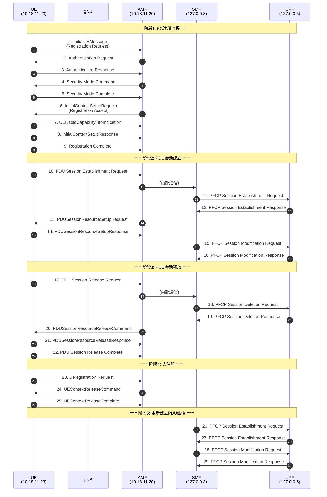

# UE 信令流程分析报告

## 基本信息

| 参数 | 值 |
|------|-----|
| **IMSI** | 460119000000004 |
| **MCC** | 460 (中国) |
| **MNC** | 11 |
| **MSIN** | 9000000004 |
| **UE IP (会话1)** | 10.57.135.106 |
| **UE IP (会话2)** | 10.57.1.192 |
| **gNB IP** | 10.18.11.23 |
| **AMF IP** | 10.18.11.20 |
| **SMF IP** | 127.0.0.3 |
| **UPF IP** | 127.0.0.5 |
| **NR Cell ID** | 0x00000000000b5001 |
| **TAC** | 1 |

---

## 流程概览



---

## 详细流程分析

### 阶段1: 5G注册流程

#### 1.1 InitialUEMessage - Registration Request
| 字段 | 值 | 说明 |
|------|-----|------|
| Frame | 6429 | |
| Time | 10.265307s | 相对时间 |
| 方向 | UE → AMF | gNB: 10.18.11.23 → AMF: 10.18.11.20 |
| 协议 | NGAP/NAS-5GS | |
| **RAN-UE-NGAP-ID** | 48 | gNB分配的UE标识 |
| **Registration Type** | 1 (Initial) | 初始注册 |
| **5GS Mobile Identity** | SUCI | |
| - SUPI Format | 0 (IMSI) | |
| - MCC | 460 | |
| - MNC | 11 | |
| - MSIN | 9000000004 | |
| - Routing Indicator | 0 | |
| - Protection Scheme | 0 (Null) | 无加密 |
| **NAS Key Set ID** | 7 | 无可用密钥 |
| **UE Security Capability** | | |
| - 5G-EA0 | 支持 | 空加密 |
| - 128-5G-EA1 | 支持 | SNOW3G |
| - 128-5G-EA2 | 支持 | AES |
| - 128-5G-EA3 | 支持 | ZUC |
| - 5G-IA0 | 支持 | 空完整性 |
| - 128-5G-IA1 | 支持 | SNOW3G |
| - 128-5G-IA2 | 支持 | AES |
| - 128-5G-IA3 | 支持 | ZUC |
| **User Location Info** | | |
| - NR Cell ID | 0x00000000000b5001 | |
| - TAC | 1 | |
| **RRC Establishment Cause** | 3 (mo-Signalling) | 移动始发信令 |

---

#### 1.2 Authentication Request
| 字段 | 值 | 说明 |
|------|-----|------|
| Frame | 6492 | |
| Time | 10.272500s | Δt = 7.19ms |
| 方向 | AMF → UE | |
| **AMF-UE-NGAP-ID** | 6009 | AMF分配的UE标识 |
| **ngKSI** | 3 | NAS密钥集标识 |
| **ABBA** | 00:00 | Anti-Bidding down Between Architectures |
| **RAND** | 21:9c:95:53:d0:31:f8:7e:b9:b4:53:d7:8f:ab:f4:90 | 128bit随机数 |
| **AUTN** | ef:63:4b:df:2d:b1:80:00:5c:1c:86:6b:e2:a9:f5:9a | 认证令牌 |
| - SQN⊕AK | ef:63:4b:df:2d:b1 | |
| - AMF | 80:00 | |
| - MAC | 5c:1c:86:6b:e2:a9:f5:9a | |

---

#### 1.3 Authentication Response
| 字段 | 值 | 说明 |
|------|-----|------|
| Frame | 6525 | |
| Time | 10.423931s | Δt = 151.43ms |
| 方向 | UE → AMF | |
| **RES*** | 56:79:b7:86:c5:34:90:98:88:f4:0f:c5:29:5a:0e:ab | 认证响应 |

---

#### 1.4 Security Mode Command
| 字段 | 值 | 说明 |
|------|-----|------|
| Frame | 6556 | |
| Time | 10.428865s | Δt = 4.93ms |
| 方向 | AMF → UE | |
| **Security Header Type** | 3 | 完整性保护+新安全上下文 |
| **MAC** | 0xc51054c6 | 消息认证码 |
| **Sequence Number** | 0 | |
| **ngKSI** | 3 | |
| **选择的NAS安全算法** | | |
| - 加密算法 | 5G-EA0 | 空加密 |
| - 完整性算法 | 128-5G-IA2 | AES |
| **Replayed UE安全能力** | 与UE上报一致 | 防止降级攻击 |
| **EPS NAS安全算法** | | |
| - TOC | 0 | |
| - TOI | 2 | |

---

#### 1.5 Security Mode Complete
| 字段 | 值 | 说明 |
|------|-----|------|
| Frame | 6559 | |
| Time | 10.453527s | Δt = 24.66ms |
| 方向 | UE → AMF | |
| **Security Header Type** | 4 | 完整性保护+加密+新安全上下文 |
| **MAC** | 0x84ee2d7c | |
| **Sequence Number** | 0 | |
| 包含内容 | IMEISV等 | 加密后的NAS消息 |

---

#### 1.6 InitialContextSetupRequest - Registration Accept
| 字段 | 值 | 说明 |
|------|-----|------|
| Frame | 6780 | |
| Time | 10.470712s | Δt = 17.19ms |
| 方向 | AMF → UE | |
| **Security Header Type** | 2 | 完整性保护+加密 |
| **MAC** | 0x6be938fd | |
| **Sequence Number** | 1 | |
| **UE Aggregate Max Bit Rate** | | |
| - 下行 | 10 Gbps | |
| - 上行 | 10 Gbps | |
| **GUAMI** | | |
| - PLMN | 460-11 | |
| - AMF Region ID | 05 | |
| - AMF Set ID | 00:80 | |
| - AMF Pointer | 04 | |
| **Allowed NSSAI** | | |
| - S-NSSAI | SST=01 | eMBB |
| **UE Security Capabilities** | | |
| - NR加密 | NEA1, NEA2, NEA3 | |
| - NR完整性 | NIA1, NIA2, NIA3 | |
| - E-UTRA加密 | 无 | |
| - E-UTRA完整性 | 无 | |
| **Security Key** | 0f:3b:75:e6:df:15:8d:16... | KgNB |
| **Index to RFSP** | 1 | |
| **RRC Inactive Transition** | 上报请求 | |
| **Redirection Voice Fallback** | 不允许 | |

---

#### 1.7 UERadioCapabilityInfoIndication
| 字段 | 值 | 说明 |
|------|-----|------|
| Frame | 6798 | |
| Time | 10.540482s | Δt = 69.77ms |
| 方向 | UE → AMF | |
| **UE Radio Capability** | 1619 bytes | |
| - NR Capability | Access Stratum Release 15 | |
| - LTE Capability | UE Category 4 | |
| - Feature Set Combinations | 2组 | |

---

#### 1.8 InitialContextSetupResponse
| 字段 | 值 | 说明 |
|------|-----|------|
| Frame | 6799 | |
| Time | 10.540482s | 与上一消息同时 |
| 方向 | UE → AMF | |
| **结果** | 成功 | |

---

#### 1.9 Registration Complete
| 字段 | 值 | 说明 |
|------|-----|------|
| Frame | 6801 | |
| Time | 10.540550s | Δt = 0.07ms |
| 方向 | UE → AMF | |
| **Security Header Type** | 2 | 完整性保护+加密 |
| **MAC** | 0x7bee6e20 | |
| **Sequence Number** | 1 | |

---

### 阶段2: PDU会话建立

#### 2.1 PDU Session Establishment Request
| 字段 | 值 | 说明 |
|------|-----|------|
| Frame | 7322 | |
| Time | 11.084157s | Δt = 543.6ms |
| 方向 | UE → AMF | |
| **MAC** | 0x3cfff3a9 | |
| **Sequence Number** | 2 | |
| **PDU Session ID** | 5 | |
| **请求的PDN类型** | IPv4v6 | |
| **S-NSSAI** | SST=01 | eMBB |
| **DNN** | ctnet | |

---

#### 2.2 PFCP Session Establishment Request
| 字段 | 值 | 说明 |
|------|-----|------|
| Frame | 7558 | |
| Time | 11.112498s | Δt = 28.34ms |
| 方向 | SMF → UPF | 127.0.0.3 → 127.0.0.5 |
| **F-SEID (SMF)** | 0x11ea750173b89fbe | |
| **Node ID** | 127.0.0.3 | SMF地址 |
| **PDN Type** | IPv4v6 | |
| **RAT Type** | NR | |
| **User ID (IMSI)** | 460119000000004 | |
| **User Plane Inactivity Timer** | 3600s | 1小时 |

**Create PDR (上行) - PDR ID: 2927**
| 字段 | 值 |
|------|-----|
| Precedence | 255 |
| Source Interface | Access |
| F-TEID | TEID=0x10000b4b, IPv4=10.18.11.20 |
| UE IP Address | 10.57.135.106 |
| QFI | 1 |
| SDF Filter | permit out ip from any to assigned |
| FAR ID | 2927 |
| QER ID | 4355 |
| URR ID | 2891 |
| Outer Header Removal | GTP-U/UDP/IP |

**Create PDR (下行) - PDR ID: 2928**
| 字段 | 值 |
|------|-----|
| Precedence | 255 |
| Source Interface | Core |
| UE IP Address | 10.57.135.106 |
| QFI | 1 |
| SDF Filter | permit out ip from any to assigned |
| FAR ID | 2928 |
| QER ID | 4355 |
| URR ID | 2891 |

**Create FAR (上行) - FAR ID: 2927**
| 字段 | 值 |
|------|-----|
| Apply Action | Forward |
| Destination Interface | Core (N6) |
| Network Instance | ctnet |
| 3GPP Interface Type | N6 |

**Create FAR (下行) - FAR ID: 2928**
| 字段 | 值 |
|------|-----|
| Apply Action | Forward |
| Destination Interface | Access |
| Network Instance | ctnet |

**Create QER - QER ID: 4355**
| 字段 | 值 |
|------|-----|
| QFI | 1 |
| Gate Status | UL/DL均开放 |
| MBR (UL/DL) | 1 Mbps |
| GBR (UL/DL) | 1 Mbps |

**Create URR - URR ID: 2891**
| 字段 | 值 |
|------|-----|
| Measurement Method | Volume |
| Reporting Trigger | Volume Threshold |
| Volume Threshold | 1 GB |

**Create BAR - BAR ID: 1**
| 字段 | 值 |
|------|-----|
| DL Data Notification Delay | 0 ms |
| Suggested Buffering Packets Count | 255 |

---

#### 2.3 PFCP Session Establishment Response
| 字段 | 值 | 说明 |
|------|-----|------|
| Frame | 7559 | |
| Time | 11.113048s | Δt = 0.55ms |
| 方向 | UPF → SMF | |
| **Cause** | Request accepted | 成功 |
| **F-SEID (UPF)** | 0x00008a15b24cc000 | |
| **Node ID** | 127.0.0.5 | UPF地址 |

---

#### 2.4 PDUSessionResourceSetupRequest
| 字段 | 值 | 说明 |
|------|-----|------|
| Frame | 7572 | |
| Time | 11.117263s | Δt = 4.22ms |
| 方向 | AMF → UE | |
| **MAC** | 0x49304972 | |
| **Sequence Number** | 2 | |
| **PDU Session ID** | 5 | |
| **S-NSSAI** | SST=01 | |
| **PDU Session Type** | IPv4 | |
| **PDU Session AMBR** | | |
| - 下行 | 1 Gbps | |
| - 上行 | 1 Gbps | |
| **UL GTP Tunnel** | | N3隧道信息 |
| - TEID | 0x10000b4b | |
| - Transport Address | 10.18.11.20 | UPF N3地址 |
| **Security Indication** | | |
| - Integrity Protection | Not needed | |
| - Confidentiality Protection | Not needed | |
| **QoS Flow** | | |
| - QFI | 1 | |
| - 5QI | 9 | Non-GBR, 默认 |
| - ARP Priority | 10 | |

**NAS PDU包含的PDU Session信息**
| 字段 | 值 |
|------|-----|
| 分配的UE IP | 10.57.135.106 |
| DNN | ctnet |
| S-NSSAI | SST=01 |

---

#### 2.5 PDUSessionResourceSetupResponse
| 字段 | 值 | 说明 |
|------|-----|------|
| Frame | 7583 | |
| Time | 11.143918s | Δt = 26.66ms |
| 方向 | UE → AMF | |
| **PDU Session ID** | 5 | |
| **DL GTP Tunnel** | | gNB分配的隧道 |
| - TEID | 0x000000bb | |
| - Transport Address | 10.18.11.23 | gNB地址 |
| **Associated QoS Flow** | QFI=1 | |

---

#### 2.6 PFCP Session Modification Request
| 字段 | 值 | 说明 |
|------|-----|------|
| Frame | 7602 | |
| Time | 11.148791s | Δt = 4.87ms |
| 方向 | SMF → UPF | |
| **SEID** | 0x00008a15b24cc000 | UPF SEID |

**Update FAR - FAR ID: 2928**
| 字段 | 值 | 说明 |
|------|-----|------|
| Apply Action | Forward | |
| Destination Interface | Access | |
| **Outer Header Creation** | | **新增** |
| - Description | GTP-U/UDP/IPv4 | |
| - TEID | 0x000000bb | gNB分配 |
| - IPv4 | 10.18.11.23 | gNB地址 |

---

#### 2.7 PFCP Session Modification Response
| 字段 | 值 | 说明 |
|------|-----|------|
| Frame | 7603 | |
| Time | 11.149224s | Δt = 0.43ms |
| 方向 | UPF → SMF | |
| **Cause** | Request accepted | 成功 |

---

### 阶段3: PDU会话释放

#### 3.1 PDU Session Release Request
| 字段 | 值 | 说明 |
|------|-----|------|
| Frame | 166162 | |
| Time | 259.592018s | Δt = 248.44s (约4分钟后) |
| 方向 | UE → AMF | |
| **MAC** | 0x0c72392f | |
| **Sequence Number** | 3 | |
| **PDU Session ID** | 5 | |

---

#### 3.2 PFCP Session Deletion Request
| 字段 | 值 | 说明 |
|------|-----|------|
| Frame | 166194 | |
| Time | 259.597142s | Δt = 5.12ms |
| 方向 | SMF → UPF | |
| **SEID** | 0x00008a15b24cc000 | |

---

#### 3.3 PFCP Session Deletion Response
| 字段 | 值 | 说明 |
|------|-----|------|
| Frame | 166195 | |
| Time | 259.597359s | Δt = 0.22ms |
| 方向 | UPF → SMF | |
| **Cause** | Request accepted | 成功 |

---

#### 3.4 PDUSessionResourceReleaseCommand
| 字段 | 值 | 说明 |
|------|-----|------|
| Frame | 166240 | |
| Time | 259.599815s | Δt = 2.46ms |
| 方向 | AMF → UE | |
| **MAC** | 0x4c32d00b | |
| **Sequence Number** | 3 | |
| **PDU Session ID** | 5 | |
| **Release Cause** | NAS: Normal release | |

---

#### 3.5 PDUSessionResourceReleaseResponse
| 字段 | 值 | 说明 |
|------|-----|------|
| Frame | 166249 | |
| Time | 259.622962s | Δt = 23.15ms |
| 方向 | UE → AMF | |
| **PDU Session ID** | 5 | |

---

#### 3.6 PDU Session Release Complete
| 字段 | 值 | 说明 |
|------|-----|------|
| Frame | 166298 | |
| Time | 259.642301s | Δt = 19.34ms |
| 方向 | UE → AMF | |
| **MAC** | 0x06c224b5 | |
| **Sequence Number** | 4 | |

---

### 阶段4: 去注册

#### 4.1 Deregistration Request
| 字段 | 值 | 说明 |
|------|-----|------|
| Frame | 166448 | |
| Time | 259.711647s | Δt = 69.35ms |
| 方向 | UE → AMF | |
| **MAC** | 0x232c0c3a | |
| **Sequence Number** | 5 | |
| **5G-GUTI** | | 隐含在加密消息中 |

---

#### 4.2 UEContextReleaseCommand
| 字段 | 值 | 说明 |
|------|-----|------|
| Frame | 166453 | |
| Time | 259.713373s | Δt = 1.73ms |
| 方向 | AMF → gNB | |
| **AMF-UE-NGAP-ID** | 6009 | |
| **RAN-UE-NGAP-ID** | 48 | |
| **Cause** | NAS: Deregistration | 去注册 |

---

#### 4.3 UEContextReleaseComplete
| 字段 | 值 | 说明 |
|------|-----|------|
| Frame | 166454 | |
| Time | 259.714970s | Δt = 1.60ms |
| 方向 | gNB → AMF | |
| **User Location Info** | | |
| - NR Cell ID | 0x00000000000b5001 | |
| - TAC | 1 | |

---

### 阶段5: 新PDU会话建立（Service Request后）

#### 5.1 PFCP Session Establishment Request (新会话)
| 字段 | 值 | 说明 |
|------|-----|------|
| Frame | 168600 | |
| Time | 262.337495s | Δt = 2.62s |
| 方向 | SMF → UPF | |
| **F-SEID (SMF)** | 0x11ea750173b89fbe | 与之前相同 |

**关键参数变化**
| 参数 | 旧值 | 新值 |
|------|------|------|
| PDR ID (上行) | 2927 | 2929 |
| PDR ID (下行) | 2928 | 2930 |
| FAR ID (上行) | 2927 | 2929 |
| FAR ID (下行) | 2928 | 2930 |
| QER ID | 4355 | 4358 |
| URR ID | 2891 | 2893 |
| F-TEID (N3) | 0x10000b4b | 0x10000b4d |
| **UE IP Address** | 10.57.135.106 | **10.57.1.192** |

---

#### 5.2 PFCP Session Establishment Response
| 字段 | 值 | 说明 |
|------|-----|------|
| Frame | 168601 | |
| Time | 262.338051s | Δt = 0.56ms |
| 方向 | UPF → SMF | |
| **Cause** | Request accepted | |
| **F-SEID (UPF)** | 0x00008b0b088cc000 | **新的UPF SEID** |

---

#### 5.3 PFCP Session Modification Request
| 字段 | 值 | 说明 |
|------|-----|------|
| Frame | 168692 | |
| Time | 262.388234s | Δt = 50.18ms |
| 方向 | SMF → UPF | |
| **SEID** | 0x00008b0b088cc000 | |

**Update FAR - FAR ID: 2930**
| 字段 | 值 |
|------|-----|
| Outer Header Creation TEID | 0x000000bd |
| Outer Header Creation IPv4 | 10.18.11.23 |

---

#### 5.4 PFCP Session Modification Response
| 字段 | 值 | 说明 |
|------|-----|------|
| Frame | 168693 | |
| Time | 262.388691s | Δt = 0.46ms |
| 方向 | UPF → SMF | |
| **Cause** | Request accepted | |

---

## 参数变化对比表

### UE标识参数
| 参数 | 值 | 说明 |
|------|-----|------|
| RAN-UE-NGAP-ID | 48 | gNB分配，整个流程不变 |
| AMF-UE-NGAP-ID | 6009 | AMF分配，整个流程不变 |

### 安全参数演进
| 阶段 | MAC | Seq | Security Header |
|------|-----|-----|-----------------|
| Authentication Req | - | - | 0 (Plain) |
| Security Mode Cmd | 0xc51054c6 | 0 | 3 (Int+NewCtx) |
| Security Mode Cmp | 0x84ee2d7c | 0 | 4 (Int+Enc+NewCtx) |
| Registration Accept | 0x6be938fd | 1 | 2 (Int+Enc) |
| Registration Complete | 0x7bee6e20 | 1 | 2 (Int+Enc) |
| PDU Session Est Req | 0x3cfff3a9 | 2 | 2 (Int+Enc) |
| PDU Session Setup | 0x49304972 | 2 | 2 (Int+Enc) |
| PDU Session Rel Req | 0x0c72392f | 3 | 2 (Int+Enc) |
| PDU Session Rel Cmd | 0x4c32d00b | 3 | 2 (Int+Enc) |
| PDU Session Rel Cmp | 0x06c224b5 | 4 | 2 (Int+Enc) |
| Deregistration Req | 0x232c0c3a | 5 | 2 (Int+Enc) |

### GTP隧道参数对比
| 会话 | 方向 | TEID | IP地址 | 端点 |
|------|------|------|--------|------|
| 会话1 | N3 UL | 0x10000b4b | 10.18.11.20 | UPF |
| 会话1 | N3 DL | 0x000000bb | 10.18.11.23 | gNB |
| 会话2 | N3 UL | 0x10000b4d | 10.18.11.20 | UPF |
| 会话2 | N3 DL | 0x000000bd | 10.18.11.23 | gNB |

### PFCP会话标识对比
| 会话 | SMF F-SEID | UPF F-SEID |
|------|------------|------------|
| 会话1 | 0x11ea750173b89fbe | 0x00008a15b24cc000 |
| 会话2 | 0x11ea750173b89fbe | 0x00008b0b088cc000 |

---

## 时序统计

| 阶段 | 起始帧 | 结束帧 | 起始时间 | 结束时间 | 耗时 |
|------|--------|--------|----------|----------|------|
| 注册流程 | 6429 | 6801 | 10.265s | 10.541s | 276ms |
| PDU会话建立 | 7322 | 7603 | 11.084s | 11.149s | 65ms |
| PDU会话释放 | 166162 | 166298 | 259.592s | 259.642s | 50ms |
| 去注册 | 166448 | 166454 | 259.712s | 259.715s | 3ms |
| 新PDU会话建立 | 168600 | 168693 | 262.337s | 262.389s | 52ms |

---

## 网络拓扑

```
                                    ┌─────────────┐
                                    │   Internet  │
                                    └──────┬──────┘
                                           │
                                    ┌──────┴──────┐
                                    │  UPF (N6)   │
                                    │  127.0.0.5  │
                                    └──────┬──────┘
                                           │ N4 (PFCP)
                                    ┌──────┴──────┐
                                    │     SMF     │
                                    │  127.0.0.3  │
                                    └──────┬──────┘
                                           │
┌─────────┐    ┌─────────────┐     ┌──────┴──────┐
│   UE    │────│     gNB     │─────│     AMF     │
│         │    │ 10.18.11.23 │ N2  │ 10.18.11.20 │
└─────────┘    └──────┬──────┘     └─────────────┘
                      │ N3 (GTP-U)
               ┌──────┴──────┐
               │  UPF (N3)   │
               │ 10.18.11.20 │
               └─────────────┘

UE IP地址:
  会话1: 10.57.135.106
  会话2: 10.57.1.192
DNN: ctnet
S-NSSAI: SST=01 (eMBB)
```

---

## 总结

本次抓包记录了IMSI 460119000000004的完整5G信令流程：

1. **注册阶段**: UE成功完成5G初始注册，包括认证(5G-AKA)和安全模式建立
2. **PDU会话建立**: 建立了PDU Session ID=5的数据会话，分配IP 10.57.135.106
3. **PDU会话释放**: 约4分钟后UE主动释放PDU会话
4. **去注册**: UE发起去注册，释放所有上下文
5. **重新建立会话**: 约2.6秒后重新建立PDU会话，分配新IP 10.57.1.192

整个流程展示了完整的5G NR注册、会话管理和去注册过程，涉及NGAP、NAS-5GS和PFCP协议的交互。
